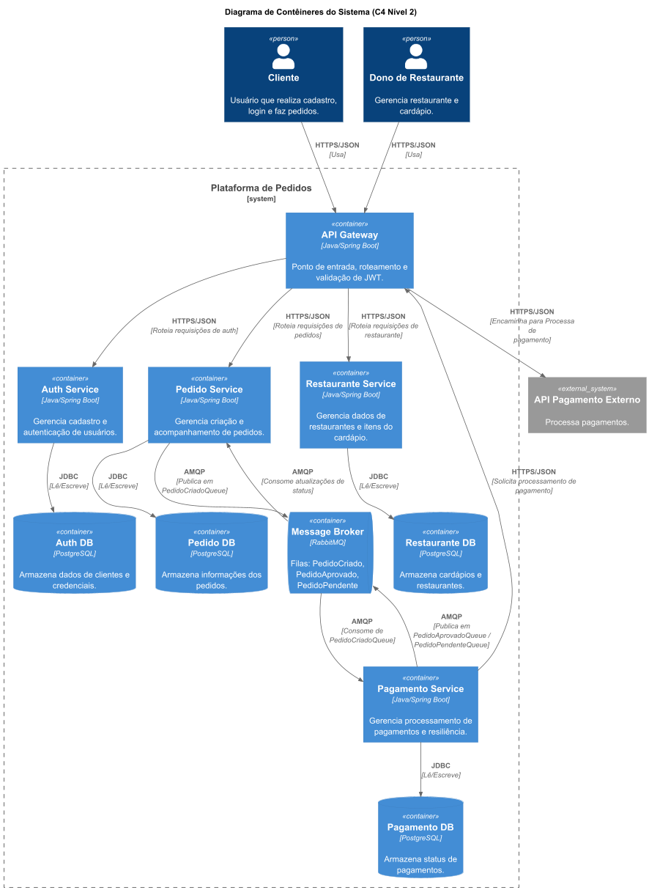

# Descrição da Arquitetura de Contêineres (C4)

A arquitetura do sistema, representada no diagrama de contêineres C4, descreve uma plataforma de pedidos para restaurantes projetada com base em uma arquitetura de microsserviços. A seguir, são detalhados os principais componentes e suas interações.

### Atores

- **Cliente**: Usuário final que se cadastra, faz login e realiza pedidos na plataforma.
- **Dono de Restaurante**: Responsável por gerenciar as informações do seu restaurante e o cardápio de produtos.

### Sistema Externo

- **API de Pagamento Externo**: Um serviço de terceiros utilizado para processar os pagamentos dos pedidos.

### Contêineres da Plataforma de Pedidos

A plataforma é composta por um conjunto de serviços independentes (microsserviços), cada um com sua responsabilidade e banco de dados, que se comunicam de forma síncrona e assíncrona.

1. **API Gateway** (`Java/Spring Boot`):

   - **Função**: Atua como o ponto de entrada único (*Single Point of Entry*) para todas as requisições externas. É responsável por rotear as chamadas para os microsserviços apropriados e servir como um ponto de saída para comunicação com sistemas externos.
   - **Interações**: Recebe requisições HTTPS/JSON do **Cliente** e do **Dono de Restaurante**. Encaminha as solicitações de pagamento do **Pagamento Service** para a **API de Pagamento Externo**.
2. **Auth Service** (`Java/Spring Boot`):

   - **Função**: Gerencia o cadastro e a autenticação de todos os usuários da plataforma.
   - **Banco de Dados**: `Auth DB` (PostgreSQL), que armazena os dados dos clientes e suas credenciais.
   - **Interações**: Recebe requisições do **API Gateway** e acessa seu banco de dados via JDBC.
3. **Restaurante Service** (`Java/Spring Boot`):

   - **Função**: Responsável por gerenciar os dados dos restaurantes e os itens do cardápio.
   - **Banco de Dados**: `Restaurante DB` (PostgreSQL), para armazenar as informações dos restaurantes e seus respectivos cardápios.
   - **Interações**: Recebe requisições do **API Gateway** e se comunica com seu banco de dados via JDBC.
4. **Pedido Service** (`Java/Spring Boot`):

   - **Função**: Orquestra a criação e o acompanhamento do ciclo de vida dos pedidos.
   - **Banco de Dados**: `Pedido DB` (PostgreSQL), onde são armazenadas as informações dos pedidos.
   - **Interações**:
     - Recebe requisições do **API Gateway**.
     - Publica um evento `PedidoCriado` no **Message Broker** quando um novo pedido é confirmado.
     - Consome eventos das filas `PedidoAprovado` e `PedidoPendente` para atualizar o status dos pedidos.
5. **Pagamento Service** (`Java/Spring Boot`):

   - **Função**: Gerencia o processamento de pagamentos, garantindo resiliência e comunicação com o sistema de pagamento externo.
   - **Banco de Dados**: `Pagamento DB` (PostgreSQL), para armazenar o status dos pagamentos.
   - **Interações**:
     - Consome eventos da fila `PedidoCriado` para iniciar o processo de pagamento.
     - Comunica-se com a **API de Pagamento Externo** (através do **API Gateway**) para processar o pagamento.
     - Publica o resultado do pagamento nas filas `PedidoAprovado` ou `PedidoPendente` do **Message Broker**.
6. **Message Broker** (`RabbitMQ`):

   - **Função**: Atua como um intermediário para a comunicação assíncrona entre os serviços, utilizando filas para garantir o desacoplamento e a resiliência.
   - **Filas Principais**: `PedidoCriado`, `PedidoAprovado`, `PedidoPendente`.
   - **Interações**: Recebe mensagens do **Pedido Service** e do **Pagamento Service** e as entrega aos serviços consumidores via protocolo AMQP.

### Fluxo Principal (Criação de Pedido e Pagamento)

1. O **Cliente** envia uma requisição para criar um pedido através do **API Gateway**.
2. O **API Gateway** autentica a requisição e a encaminha para o **Pedido Service**.
3. O **Pedido Service** persiste os dados do pedido em seu banco de dados (`Pedido DB`) e, após a confirmação, publica um evento `PedidoCriado` no **Message Broker** para iniciar o fluxo de pagamento.
4. O **Pagamento Service** consome o evento `PedidoCriado` e orquestra a comunicação com a **API de Pagamento Externo** (via **API Gateway**) para processar o pagamento.
5. Após a tentativa de pagamento, o **Pagamento Service** publica o resultado em uma fila específica: `PedidoAprovado` em caso de sucesso, ou `PedidoPendente` em caso de falha ou pagamento aguardando confirmação.
6. O **Pedido Service** consome a mensagem de status e atualiza o estado do pedido em seu banco de dados, concluindo a etapa de pagamento do fluxo.

Essa arquitetura, baseada em microsserviços, promove alta coesão e baixo acoplamento. Tal design facilita a manutenção, a escalabilidade individual dos componentes e a evolução contínua do sistema.
