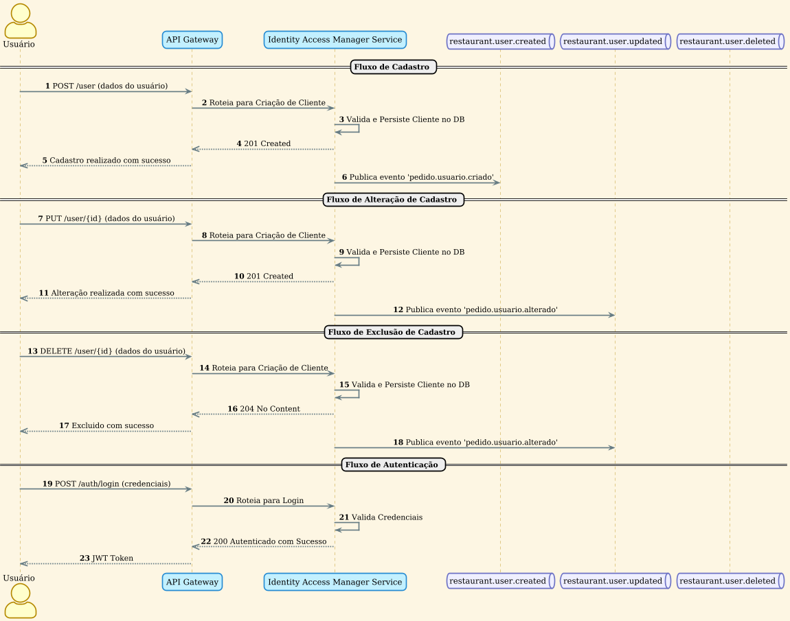

# Arquitetura e Guia Operacional do Sistema de Restaurante

Este documento detalha a arquitetura geral do sistema, os componentes, os fluxos operacionais, as decisões de design e as instruções para execução do ambiente.

## 1. Visão Geral da Arquitetura

A arquitetura do sistema é baseada em microserviços, onde cada serviço é responsável por uma parte específica do negócio. Essa abordagem oferece flexibilidade, escalabilidade e resiliência. A comunicação entre os serviços é facilitada por um API Gateway (Kong) e um sistema de mensageria (RabbitMQ).

Este repositório (`restaurant-system-infra`) centraliza a orquestração, a configuração de rede e a documentação de todo o ecossistema.

## 2. Ecossistema de Microserviços

O sistema é composto por vários microserviços independentes, cada um com uma responsabilidade clara. Abaixo estão os principais componentes do ecossistema:

### **Identity Service**
*   **Responsabilidade**: Gerencia o ciclo de vida dos usuários (cadastro, autenticação, autorização) e a emissão de tokens JWT.
*   **Imagem Docker Hub**: `kervincandido/identity-access-management`
*   **Repositório**: [KervinCandido/identity-access-management](https://github.com/KervinCandido/identity-access-management)

### **Restaurant Service**
*   **Responsabilidade**: Gerencia informações de restaurantes, como cardápios, mesas e horários de funcionamento.
*   **Imagem Docker Hub**: `kervincandido/restaurant`
*   **Repositório**: [KervinCandido/restaurant](https://github.com/KervinCandido/restaurant)

### **Order Service**
*   **Responsabilidade**: Orquestra o fluxo de criação e acompanhamento de pedidos, integrando-se com a cozinha e o sistema de pagamento.
*   **Imagem Docker Hub**: `kervincandido/order`
*   **Repositório**: [KervinCandido/order](https://github.com/KervinCandido/order)

### **Payment Service**
*   **Responsabilidade**: Processa os pagamentos dos pedidos, integrando-se com gateways de pagamento externos de forma assíncrona e resiliente.
*   **Imagem Docker Hub**: `kervincandido/restaurant-payment-service`
*   **Repositório**: [alex-dev-br/restaurant-payment-service](https://github.com/alex-dev-br/restaurant-payment-service)

### **Kong Gateway**
*   **Responsabilidade**: Atua como ponto de entrada único (API Gateway), centralizando a autenticação, o roteamento e políticas como *rate limiting*. É configurado neste repositório de infraestrutura.
*   **Imagem Docker Hub**: `kong:3.9.1-ubuntu`

## 3. Como Executar o Ambiente (Docker Compose)

### Pré-requisitos:

*   Docker e Docker Compose instalados.
*   Arquivo `.env` configurado na raiz do projeto (utilize o `.env.example` como base).

### Passo a passo:

1.  **Clone este repositório:**
    ```bash
    git clone https://github.com/KervinCandido/restaurant-system-infra.git && cd restaurant-system-infra
    ```
2.  **Suba o ecossistema:**
    ```bash
    docker-compose up -d
    ```
3.  **Verifique a saúde dos serviços:**
    ```bash
    docker-compose ps
    ```

## 4. Arquitetura de Contêineres (Modelo C4)

O diagrama de contêineres C4 descreve a estrutura de alto nível da plataforma, detalhando os principais componentes e suas interações.


### Atores

-   **Cliente**: Usuário final que se cadastra, faz login e realiza pedidos.
-   **Dono de Restaurante**: Responsável por gerenciar as informações do seu restaurante e o cardápio.

### Contêineres da Plataforma

1.  **API Gateway**: Ponto de entrada único para todas as requisições.
2.  **Auth Service (IAM)**: Gerencia o cadastro e a autenticação de usuários.
3.  **Restaurante Service**: Gerencia os dados dos restaurantes e cardápios.
4.  **Pedido Service**: Orquestra o ciclo de vida dos pedidos.
5.  **Pagamento Service**: Gerencia o processamento de pagamentos.
6.  **Message Broker (RabbitMQ)**: Facilita a comunicação assíncrona.
7.  **Bancos de Dados (PostgreSQL)**: Instâncias de banco de dados isoladas por serviço.

### Sistema Externo

-   **API de Pagamento Externo**: Serviço de terceiros para processar pagamentos.

## 5. Fluxos Operacionais (Diagramas de Sequência)

### 5.1. Serviço de Identidade e Acesso (IAM)


Gerencia o ciclo de vida do usuário (cadastro, alteração, exclusão) e a autenticação, emitindo tokens JWT.

### 5.2. Serviço de Restaurante


Gerencia o cadastro de restaurantes e seus cardápios, publicando eventos para manter outros serviços sincronizados.

### 5.3. Serviço de Pedidos


Orquestra a criação e o acompanhamento dos pedidos, consumindo e publicando eventos para interagir com os serviços de pagamento e restaurante.

### 5.4. Serviço de Pagamentos


Processa pagamentos de forma assíncrona, com lógica de retentativa para garantir resiliência.

## 6. Componentes de Infraestrutura e Decisões de Arquitetura

### 6.1. Kong (API Gateway)

O `kong-service` atua como API Gateway, centralizando o acesso, a segurança e o roteamento. Está configurado no modo **DB-less**. As principais rotas são:

*   **Identity API:** `http://localhost/auth/*`
*   **Restaurant API:** `http://localhost/restaurants/*`
*   **Order API:** `http://localhost/restaurants/{restaurant-id}/orders/*`

### 6.2. RabbitMQ (Message Broker)

A escolha pelo **RabbitMQ** foi motivada por sua adequação ao padrão de comunicação transacional do sistema, garantindo a entrega única de mensagens com baixa latência, o que é crucial para a integridade do fluxo de pagamento.

### 6.3. Bancos de Dados (PostgreSQL)

Cada microserviço possui sua própria instância de banco de dados, garantindo isolamento, flexibilidade e escalabilidade independente.

### 6.4. Build e Publicação (Docker Hub)

Os microserviços são publicados como imagens no Docker Hub, o que garante portabilidade, versionamento e distribuição simplificada, além de facilitar a integração com pipelines de CI/CD.

### 6.5. Simulador de Pagamento Externo (procpag)

O `procpag` é um contêiner que simula uma API de pagamento externa. Ele opera em uma rede Docker separada, e apenas o Kong pode se comunicar com ele, simulando um cenário real de integração com serviços de terceiros.
