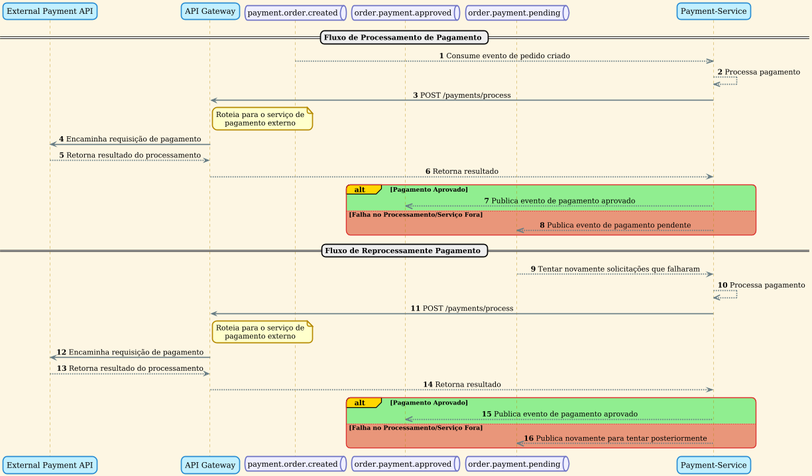

Utilizando o seguinte diagrama de sequência do serviço de
`IAM (Identity and Access Management)`, detalhamos os fluxos de operações do usuário, que abrangem desde o cadastro inicial até a autenticação para acesso ao sistema.

### Fluxos de Operações do Usuário

#### 1. Cadastro de Novo Usuário

O processo de cadastro é iniciado pelo usuário, que envia as informações necessárias para a criação de uma nova conta.

- **Requisição Inicial**: O usuário envia uma requisição `POST` para o endpoint `/user`, contendo os dados do usuário no corpo da solicitação.
- **Roteamento e Processamento**: O `API Gateway` recebe a requisição
  e a encaminha para o `Identity Access Manager Service (IAM)`.
- **Validação e Persistência**: O serviço `IAM` valida os dados recebidos e, se estiverem corretos, persiste o novo usuário em seu banco de dados.
- **Confirmação e Evento**: Após o
  cadastro bem-sucedido, o `IAM` retorna o status `201 Created` ao `API Gateway`, que por sua vez notifica o usuário. Em seguida, o `IAM` publica um evento na fila `restaurant.user.created`, informando aos demais serviços sobre o novo usuário.

#### 2. Alteração de Cadastro

O usuário pode atualizar suas informações cadastrais a qualquer momento, garantindo que seus dados estejam sempre corretos.

- **Requisição de Alteração**: O usuário envia uma requisição `PUT` para o endpoint `/user/{id}`, onde `{id}` corresponde ao identificador do usuário.
- **Processamento da Alteração**: O `API Gateway` direciona a requisição para o `IAM`, que valida os novos dados e atualiza o registro do usuário no banco de dados.
- **Confirmação e Evento de Alteração**: O `IAM` retorna o status `201 Created` e publica um evento na fila `restaurant.user.updated`, notificando outros componentes do sistema sobre a alteração.

#### 3. Exclusão de Cadastro

Caso o usuário decida não utilizar mais o sistema, ele pode solicitar a exclusão de sua conta.

- **Requisição de Exclusão**: O usuário envia uma requisição `DELETE` para o endpoint `/user/{id}`.
- **Processamento da Exclusão**: O `API Gateway` encaminha a solicitação ao `IAM`, que realiza a exclusão do usuário de seu banco de dados.
- **Confirmação e Evento de Exclusão**: Após a exclusão, o `IAM` retorna o status `204 No Content` e publica um evento na fila `restaurant.user.deleted`.

#### 4. Autenticação e Autorização

Para acessar as funcionalidades do sistema, o usuário precisa se
autenticar, garantindo a segurança e a proteção de seus dados.

- **Requisição de Login**: O usuário envia suas credenciais (usuário e senha) através de uma requisição `POST` para o endpoint `/auth/login`.
- **Validação de Credenciais**: O `API Gateway` encaminha a requisição para o `IAM`, que verifica se as credenciais são válidas.
- **Geração de Token**: Se a autenticação for bem-sucedida, o `IAM` gera um `JSON Web Token (JWT)`, que é retornado ao usuário com o status `200 Autenticado com Sucesso`. Esse token será utilizado para autorizar o acesso a outros recursos do sistema.

Este conjunto de fluxos garante um gerenciamento de identidade e acesso seguro e eficiente, permitindo que os usuários interajam com o sistema de forma controlada e protegida.
