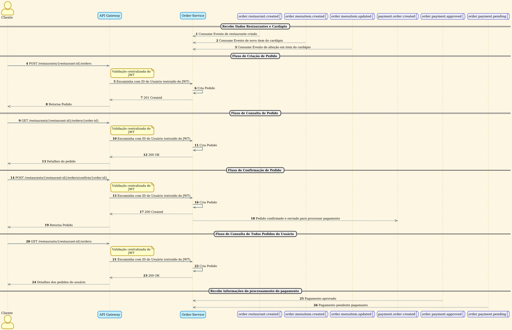

O diagrama de sequência seguinte detalha os fluxos de operações relacionados ao gerenciamento de pedidos, desde a sua criação até a confirmação e acompanhamento do pagamento.

### Fluxos de Operações de Pedidos

#### 1. Sincronização de Dados de Restaurantes e Cardápios
Para que os clientes possam fazer pedidos, o `Order-Service` precisa ter informações atualizadas sobre os restaurantes e seus cardápios. Ele obtém esses dados de forma assíncrona, consumindo eventos de outros serviços.

- **Consumo de Eventos**: O serviço monitora as seguintes filas:
    - `order.restaurant.created`: Para registrar novos restaurantes disponíveis para pedidos.
    - `order.menuitem.created`: Para adicionar novos itens de cardápio que podem ser incluídos nos pedidos.
    - `order.menuitem.updated`: Para refletir alterações nos itens de cardápio existentes.

#### 2. Criação de Pedido
O cliente inicia o processo de compra criando um novo pedido para um restaurante específico.

- **Requisição**: O cliente envia uma requisição `POST` para o endpoint `/restaurants/{restaurant-id}/orders`.
- **Validação e Roteamento**: O `API Gateway` valida o `JWT` do cliente, extrai seu ID de usuário e encaminha a requisição para o `Order-Service`.
- **Processamento**: O serviço cria um novo pedido no estado "rascunho", associado ao cliente e ao restaurante.
- **Confirmação**: O serviço retorna o status `201 Created`, e o pedido recém-criado é enviado de volta ao cliente.

#### 3. Consulta de Pedido
O cliente pode consultar os detalhes de um pedido específico a qualquer momento.

- **Requisição**: O cliente envia uma requisição `GET` para `/restaurants/{restaurant-id}/orders/{order-id}`.
- **Processamento**: O `API Gateway` valida a requisição e a encaminha para o `Order-Service`, que busca e retorna os detalhes do pedido solicitado.
- **Resposta**: O serviço responde com `200 OK` e os dados detalhados do pedido.

#### 4. Confirmação de Pedido
Após revisar o pedido, o cliente o confirma, dando início ao processo de pagamento.

- **Requisição**: O cliente envia uma requisição `POST` para `/restaurants/{restaurant-id}/orders/confirm/{order-id}`.
- **Processamento**: O `Order-Service` atualiza o status do pedido para "confirmado".
- **Evento de Pagamento**: O serviço publica um evento na fila `payment.order.created`, sinalizando ao `Payment-Service` que um novo pedido está pronto para ser processado financeiramente.
- **Confirmação**: O `API Gateway` retorna uma resposta de sucesso ao cliente.

#### 5. Consulta de Todos os Pedidos do Usuário
O cliente pode visualizar uma lista de todos os pedidos que já realizou.

- **Requisição**: O cliente envia uma requisição `GET` para `/restaurants/{restaurant-id}/orders`.
- **Processamento**: O `Order-Service` busca todos os pedidos associados ao ID do usuário.
- **Resposta**: O serviço retorna `200 OK` com a lista de pedidos do usuário.

#### 6. Atualização do Status do Pagamento
O `Order-Service` é notificado sobre o andamento do processo de pagamento para atualizar o status do pedido de acordo.

- **Consumo de Eventos de Pagamento**: O serviço escuta as filas:
    - `order.payment.approved`: Para atualizar o status do pedido para "pagamento aprovado".
    - `order.payment.pending`: Para marcar o pedido como "pagamento pendente".

Esses fluxos garantem uma gestão de pedidos coesa e integrada, permitindo que o cliente tenha uma experiência fluida desde a escolha dos itens até a finalização da compra.