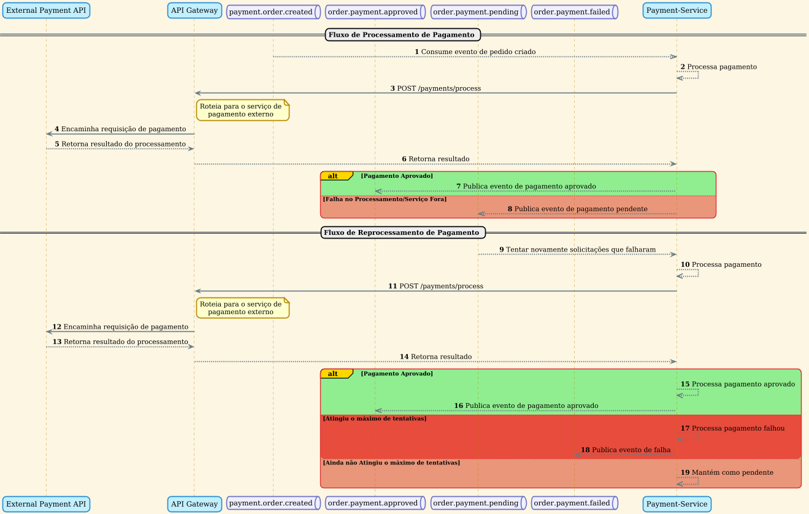

O diagrama de sequência do `Payment-Service`, descreve como o sistema gerencia o processamento de pagamentos, incluindo o fluxo principal e a lógica de retentativas para lidar com falhas.

### Fluxos de Operações de Pagamento

#### 1. Fluxo de Processamento de Pagamento

Este fluxo é iniciado assim que um cliente confirma um pedido.

- **Início do Processo**: O `Payment-Service` consome um evento da fila `payment.order.created`, que é publicado pelo `Order-Service` quando um pedido é confirmado.
- **Comunicação com o Gateway de Pagamento Externo**: O serviço envia uma requisição `POST` para o endpoint `/payments/process` no `API Gateway`. O gateway, por sua vez, roteia essa chamada para um `External Payment API` (um serviço de pagamento terceirizado), que é responsável por efetivamente processar a transação.
- **Tratamento da Resposta**: O `Payment-Service` aguarda o retorno do processamento.
  - **Pagamento Aprovado**: Se o pagamento for bem-sucedido, o serviço publica um evento na fila `order.payment.approved` para notificar outros serviços (como o `Order-Service`) sobre o sucesso da transação.
  - **Falha no Processamento**: Se houver uma falha na comunicação com o serviço externo ou se o pagamento for recusado, o serviço publica um evento na fila `order.payment.pending`. Isso indica que o pagamento não foi concluído, mas pode ser tentado novamente.

#### 2. Fluxo de Reprocessamento de Pagamento

Para garantir a resiliência do sistema, pagamentos que falharam inicialmente são reprocessados.

- **Início da Retentativa**: O `Payment-Service` consome eventos da fila `order.payment.pending`. Isso aciona uma nova tentativa de processamento para um pagamento que falhou anteriormente.
- **Nova Tentativa de Processamento**: O serviço segue o mesmo fluxo de uma transação normal, contatando o `External Payment API` através do `API Gateway`.
- **Tratamento da Resposta da Retentativa**:
  - **Pagamento Aprovado**: Se a retentativa for bem-sucedida, um evento é publicado na fila `order.payment.approved`.
  - **Falha Persistente**: Se a retentativa falhar e o número máximo de tentativas for atingido, o serviço considera o pagamento como definitivamente falho e publica um evento na fila `order.payment.failed`.
  - **Falha com Novas Tentativas**: Se a retentativa falhar, mas o limite de tentativas ainda não tiver sido alcançado, o pagamento é mantido no estado "pendente" para ser reprocessado mais tarde.

Este mecanismo de processamento e retentativa garante que o sistema de pagamento seja robusto, capaz de lidar com falhas temporárias e de comunicar de forma clara e assíncrona o status final de cada transação.
