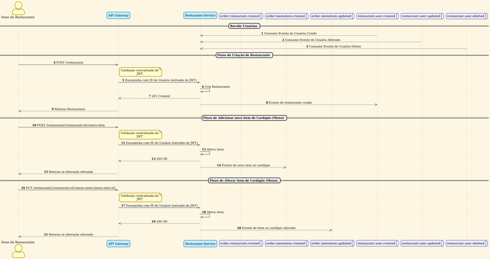

Com base no diagrama de sequência a seguir, detalhamos os fluxos de operações gerenciados por este serviço, que são essenciais para a administração de restaurantes e seus cardápios.

### Fluxos de Operações do Restaurante

#### 1. Sincronização de Usuários

O `Restaurante-Service` mantém os dados dos usuários sincronizados ao consumir eventos publicados pelo serviço de `IAM (Identity and Access Management)`. Isso garante que o serviço tenha sempre informações atualizadas sobre os proprietários dos restaurantes.

- **Consumo de Eventos**: O serviço escuta as seguintes filas para receber atualizações:
  - `restaurant.user.created`: Para novos usuários cadastrados.
  - `restaurant.user.updated`: Para alterações em dados de usuários existentes.
  - `restaurant.user.deleted`: Para usuários que foram removidos do sistema.

#### 2. Criação de Restaurante

O proprietário de um restaurante ou administrador podem cadastrar um novo estabelecimento no sistema.

- **Requisição Inicial**: O usuário envia uma requisição `POST` para o endpoint `/restaurants`.
- **Validação e Roteamento**: O `API Gateway` intercepta a requisição, valida o `JWT (JSON Web Token)` para garantir que o usuário está autenticado e extrai o ID do usuário do token. Em seguida, encaminha a requisição para o `Restaurante-Service`.
- **Processamento e Persistência**: O serviço cria e persiste as informações restaurante.
- **Confirmação e Evento**: Após a criação, o serviço retorna o status `201 Created` e publica um evento na fila `order.restaurant.created`, notificando outros serviços sobre o novo restaurante.

#### 3. Adição de Novo Item ao Cardápio

O proprietário ou funcionário podem adicionar novos itens ao cardápio de seu restaurante.

- **Requisição**: O usuário envia uma requisição `POST` para o endpoint `/restaurants/{restaurant-id}/menu-item`.
- **Validação**: O `API Gateway` valida o JWT e encaminha a requisição.
- **Processamento**: O `Restaurante-Service` adiciona o novo item ao cardápio do restaurante especificado.
- **Confirmação e Evento**: O serviço retorna o status `200 OK` e publica um evento na fila `order.menuitem.created` para informar sobre o novo item disponível.

#### 4. Alteração de Item do Cardápio

As informações de um item do cardápio podem ser atualizadas pelo proprietário ou algum funcionário do restaurante.

- **Requisição**: O usuário envia uma requisição `PUT` para o endpoint `/restaurants/{restaurant-id}/menu-item/{menu-item-id}`.
- **Validação**: O `API Gateway` realiza a validação do JWT.
- **Processamento**: O `Restaurante-Service` localiza e atualiza o item específico no cardápio.
- **Confirmação e Evento**: Após a alteração, o serviço retorna `200 OK` e publica um evento na fila `order.menuitem.updated`, sinalizando a modificação do item.

Esses fluxos garantem que os proprietários de restaurantes e/ou funcionário possam gerenciar os restaurantes e seus cardápios de forma segura e eficiente, mantendo a consistência dos dados em todo o ecossistema de serviços.
